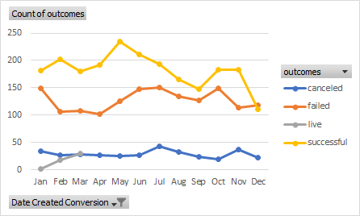

# An Analysis of Kickstarter Campaigns

Repository address: 

## Overview of Project

The purpose of this project was to analyze trends based on funding and launch dates aquired from the 
Kickstarter campaigns in order to help Louis launch her play called "Fever". 

Here's a chart showing the outcome of each category. This includes all countries.

Theater was the most successful.

Here is a chart showing the best month to launch and May seems the best month to do so.

Based on my finding I would recommend that Louise starts her funding in May and concentrate on 
Theaters as it appears to have the best chance of being successful.
