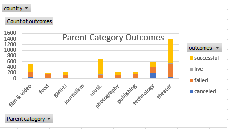

# An Analysis of Kickstarter Campaigns
Performing analysis KickStarter data to uncover trends

I added a chart showing the outcome of each category. This includes all countries.

Theater was the most successful.

Here is a chart showing the best month to launch and May seems the best month to do so.

Based on my finding I would recommend that Louise starts her funding in May and concentrate on 
Theaters as it appears to have the best chance of being successful.
