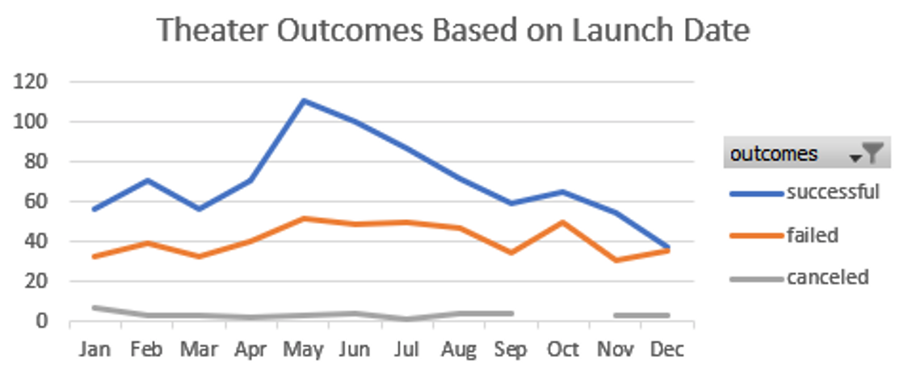

# Kickstarting with Excel

Repository address: https://github.com/cpstell/kickstarter-analysis-

## Overview of Project

To use the data I received to help Louis find the best path forward to launch her play.

### Purpose

The purpose of this project was to analyze trends based on funding and launch dates aquired from the 
Kickstarter campaigns in order to help Louis launch her play called "Fever". 

## Analysis and Challenges

The analysis was to figure out the most succesful time of the year to launch and how much money
would be needed in order to make this happen. The challenge was finding the information we needed
by analyzing the data we received.

### Analysis of Outcomes Based on Launch Date

### Analysis of Outcomes Based on Goals

### Challenges and Difficulties Encountered

The challenges and difficulties encountered were pinpointing the monetary goals and dates that made for a succesful 
launch. This was crucial to the success or failure of Louis's attempt to start a play.

## Results

- What are two conclusions you can draw about the Outcomes based on Launch Date?

May and June are the best times to launch while November and December were not good times to launch.

- What can you conclude about the Outcomes based on Goals?

$5,000 or less was the best monetary goal for success.

- What are some limitations of this dataset?

The limitations of this dataset is that doesn't give us everyting we need to see the whole picture. By 
having more information in terms of investors and money we could refine our results even more.

- What are some other possible tables and/or graphs that we could create?

We could take the same information and present it in a different graph or chart like a Box and Whisker
chart or pie chart.

